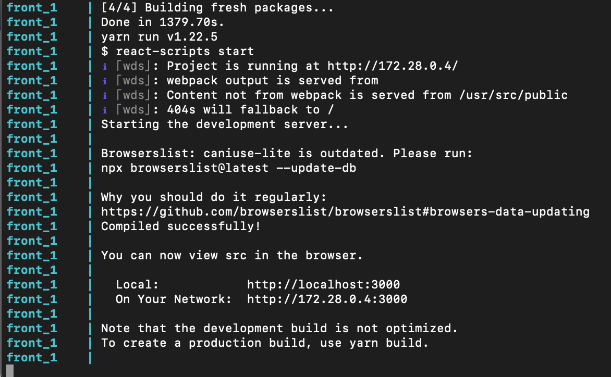

# my-fabulous-bottle-of-bordeaux-wine
Based on the characteristics of the wines, the objective is to recommend wines with similar characteristics using NearestNeighbors-based classification.

## Requirement

- docker
- docker-compose

Tested and developed using Chrome on MacOS (not required).

## Architecture Overview

- All services run in Docker containers.
- The frontend is written using React.
- The reverse proxy stands to avoid CORS complications and be as close as possible to a production environment.
- The API is written using FastAPI, a Python framework:
  - written in Go and Python and taking advantage of the last python concurrency and threading support (API endpoint ran in threads)
  - allowing to esealy load and run serialized sklearn models (since it is a Python framework)
- The [mlm](./mlm) folder contains the python script to prepare datas and ML model. (For now csv file and serialized NearestNeighbors class file are manually pasted respectively in [db](./db) and [API](./api/app) folders)

## Demo

### Setup

- Clone (or download) this repository
- Open a terminal and `cd` into the cloned repo
- Run `docker-compose up`
  - All other services will be availlable in a minute
  - But the front container may take a while to install node modules. Wait to see this output before using it 

Once everything's up, you can use/modify the app, hot reloading available on the front and the api.

If you want to modify the database, reset it like this once you want to apply you changes:

`docker-compose down --volumes`

then 

`docker-compose up`

### Links and overview

- OpenAPI docmentation of the API is availlable here http://localhost/api/docs.

FYI: This interface allows to try/use/test the API endpoints if needed. This endpoint http://localhost/api/docs#/default/read_kneighbors_of_wine_wines_kneighbors_get will suggests a maximum of `count` wines based on the one identifyed by here `name` and `millesime`. These are ordered by `jaccard` distance.

- Front availlable here http://localhost/.

  - The `Name` input performs delayed API request to search wines containing the input text in their name.
  - The result of this search is displayed in the list below. This list is virtualized (render the react elements when needed) and 'lazy loaded' (requests elements to the API when needed). In this way only a few data is fetch from the API and rendered to preserve performance and UX.
  - The `SelectInput` (number) limits the number of wine sugestion requested.

- Adminer is a simple DB interface administration. Reachable here http://localhost:8081/.
  - `login / password` : `postgres / example`

## Some possible improvements

- Display distance of the suggested wines.
- Use [ONNX](https://onnxruntime.ai/) 
  - to serialize 
  - then run the ML model in a compiled langage
  - expose it through gRPC to the API. Uncoupling the ML model and the API allows to improve disponibility (rolling update and round robin of the API and/or the model), performance (running the the ML model in an compiled langage like C++ or Go), and reduce vulnerability surface (no python interpreter or Java VM, only the C lib required).
- Documentation
- (unit)Tests
- Store the `tastes` column (JSON array of boolean) as byte array
- Provide a more ready to prod `docker-compose` ()
